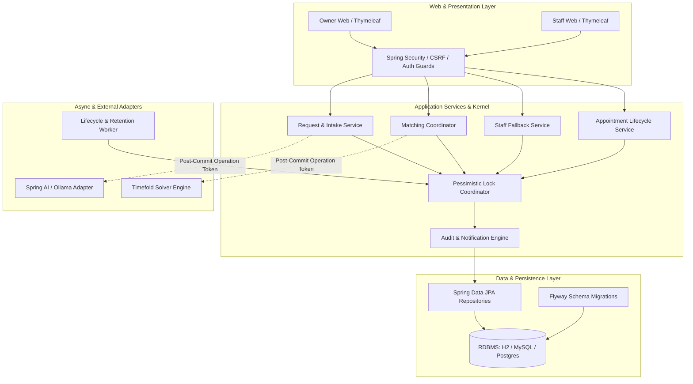

# Requirements

### Overview & Goals
The Smart Appointment Scheduling feature extends the Spring PetClinic application with an intelligent, authenticated, single-clinic scheduling capability. Pet owners can submit natural-language availability and visit descriptions in English, give explicit consent for AI-assisted interpretation, confirm structured request parameters, and receive one guided appointment suggestion at a time. Clinic staff manage veterinarians, clinic configuration, calendar exceptions, direct bookings, rescheduling, and a fallback queue for all requests that automation cannot safely complete.

The primary goal of this execution plan is to implement all 28 tasks across the 5 phases defined in `spec/smart-appointment-scheduling/tasks.yaml`, satisfying all 357 acceptance criteria and applying the 12 global technical rules (`RULE-1` through `RULE-12`).

### Scope
#### In Scope
- **Phase 1: Risk Foundations & Secure Access (Tasks 1.1–1.7)**: Java 21 upgrade, Flyway vendor baselines and migrations, domain persistence kernel, Spring Security form login/CSRF/lockout, account provisioning, owner self-service, and audit/notification persistence.
- **Phase 2: Clinic Calendar & Interpreted Request (Tasks 2.1–2.7)**: Clinic settings, veterinarian schedules, calendar conflict tracking, natural-language intake, Spring AI/Ollama interpretation dispatch, clarification/confirmation flow, and atomic text replacement/cancellation.
- **Phase 3: Guided Matching & Staff Fallback (Tasks 3.1–3.7)**: Timefold single-request solver model, guided hold reservation lifecycle, suggestion accept/reject/expiry, prioritized staff fallback queue, staff claims, staff offers, and direct fallback booking.
- **Phase 4: Appointment Lifecycle (Tasks 4.1–4.7)**: Timed appointments, owner cancellation, staff direct booking, staff rescheduling with conflict resolution, completion with exactly-once `Visit` creation, and removal of legacy Visit booking routes.
- **Phase 5: Notifications, Retention, Recovery & Diagnostics (Tasks 5.1–5.7)**: In-app notifications, comprehensive event audit logs, 30-day sensitive data purging, periodic deadline processing, startup crash recovery, staff diagnostics, and multi-database verification (H2, MySQL, PostgreSQL).

#### Out of Scope
- Multi-clinic support or per-user time zone configuration.
- Owner self-registration, public scheduling APIs, or external notification channels (SMS/Email/Push).
- Automated re-optimization or moving of pinned/existing appointments.
- Whole-clinic schedule solving (solving is strictly single-request bounded).

### User Stories
- **As a Pet Owner**, I want to describe my pet's visit reason and availability in plain text so that I can schedule an appointment without navigating complex calendar grids.
- **As a Pet Owner**, I want to review and confirm structured interpretation results and receive one held suggestion at a time so that I can easily accept or reject options.
- **As a Clinic Staff Member**, I want a centralized fallback queue and calendar view so that I can assist owners with complex needs, resolve scheduling conflicts, and manage daily clinic operations.
- **As a Clinic Staff Member**, I want to configure veterinarian availability, split shifts, and clinic operating rules so that the automated solver adheres to real-world clinic constraints.
- **As a System Administrator**, I want sensitive intake data purged after 30 days and full audit trails preserved so that privacy and operational compliance are maintained.

### Functional Requirements
1. **Authentication & Authorization**: Role-based access control separating `OWNER` and `STAFF`. Ownership checks ensure owners access only their own pets, requests, appointments, and notifications.
2. **Deterministic Time & Settings**: Clinic operates in a single configured `ZoneId` (UTC default). Time slots are quantized to 15-minute intervals. Nonexistent/ambiguous DST times are strictly rejected.
3. **AI Interpretation**: English intake text is interpreted via Spring AI/Ollama into structured duration, clinical routing (`GENERAL` vs `SPECIALTY`), time windows, and urgency indicators. Explicit owner consent is mandatory prior to dispatch.
4. **Guided Matching**: Single-request Timefold optimization suggests the highest-ranked feasible slot, placing a temporary `GUIDED_HOLD` (default 5 minutes). Pinned appointments are never altered.
5. **Staff Fallback Queue**: Requests with missing requirements, AI/solver failures, expired holds, or urgency flags enter the prioritized staff queue (urgency + FIFO). Staff can claim, edit structured facts, offer slots, or book directly.
6. **Appointment Management**: Booked appointments support owner cancellation, staff rescheduling, staff cancellation, and completion (which creates exactly one `Visit` record in pet history).
7. **Audit & Notifications**: Domain mutations synchronously append immutable audit records and queue role-scoped in-app notifications.

### Non-Functional Requirements
- **Data Integrity & Concurrency**: Ordered pessimistic locking (`Owner -> Pet -> Vet -> SchedulingRequest -> Appointment -> Reservation`) across all transactional operations to prevent deadlocks and race conditions.
- **Privacy & Security**: Passwords hashed with BCrypt; allowlisted DTOs at all public/internal boundaries; zero leakage of passwords, AI text, or clinical notes in logs, diagnostics, or exceptions.
- **Portability & Build Equivalence**: Full compatibility across H2, MySQL, and PostgreSQL. Maven and Gradle builds run equivalently on Java 21.

# Technical Design

### Current Implementation
The current application is a Spring Boot 4.1 monolith using Spring Data JPA, Thymeleaf, and Spring MVC. It contains:
- Domain entities: `Owner`, `Pet`, `PetType`, `Visit`, `Vet`, `Specialty`.
- Basic unauthenticated controllers: `OwnerController`, `PetController`, `VetController`, `VisitController`.
- Direct `schema.sql` and `data.sql` database initialization without schema versioning.
- Date-only `Visit` tracking via `/owners/{ownerId}/pets/{petId}/visits/new`.

### Key Decisions
- **Dec-1: Risk-First Foundation**: Establish Flyway baselines, time abstractions, locking order, and Spring Security before implementing scheduling slices.
- **Dec-2: Flyway-Only Schema Ownership**: Disable Spring SQL initialization; maintain vendor-specific V1 baseline migrations and V2+ scheduling migrations for H2, MySQL, and PostgreSQL.
- **Dec-3: Centralized Transactional Kernel**: Standardize state transitions, pessimistic locking, operation tokens, and audit/notification writes into shared application service primitives.
- **Dec-4: Single-Request Bounded Solving**: Use Timefold for isolated single-request slot matching against an immutable planning snapshot; do not attempt whole-clinic reoptimization.
- **Dec-5: Split Build Responsibilities**: Maven owns the multi-database migration and concurrency integration matrix; Gradle runs the equivalent unit and MVC security suites.

### Architecture Diagram

### Data Models / Contracts
- **`SchedulingRequest`**: `id`, `owner_id`, `pet_id`, `status` (`AWAITING_CONSENT`, `INTERPRETING`, `CLARIFICATION_REQUIRED`, `AWAITING_CONFIRMATION`, `MATCHING`, `SLOT_HELD`, `STAFF_QUEUED`, `STAFF_OFFERED`, `CONFIRMED`, `CANCELLED`, `EXPIRED`), `original_text`, `language`, `urgent`, `care_type`, `required_specialty_id`, `preferred_vet_id`, `duration_minutes`, `owner_horizon_end`, `first_queued_at`, `version`.
- **`Reservation`**: `id`, `reservation_type` (`GUIDED_HOLD`, `STAFF_OFFER`), `status` (`ACTIVE`, `ACCEPTED`, `REJECTED`, `EXPIRED`, `REVOKED`, `CLEARED`), `request_id`, `owner_id`, `pet_id`, `vet_id`, `start_time`, `end_time`, `expires_at`, `version`.
- **`Appointment`**: `id`, `status` (`BOOKED`, `COMPLETED`, `CANCELLED`, `NO_SHOW`), `owner_id`, `pet_id`, `vet_id`, `care_type`, `required_specialty_id`, `start_time`, `end_time`, `cancellation_reason`, `booking_source`, `version`.
- **`AuditRecord`**: `id`, `event_type`, `actor_username`, `actor_role`, `target_entity_type`, `target_entity_id`, `occurred_at`, `metadata_json`.
- **`Notification`**: `id`, `owner_id`, `title_key`, `message_key`, `target_url`, `read_status`, `created_at`.

### Components
- **`org.springframework.samples.petclinic.security`**: Form login configuration, authentication handlers, `Account` entity, `AccountService`, password hashing, session registry.
- **`org.springframework.samples.petclinic.scheduling.config`**: `ClinicSettings` aggregate, `ClinicSettingsService`, time validation beans (`Clock`, `ZoneId`).
- **`org.springframework.samples.petclinic.scheduling.calendar`**: `VeterinarianSchedule` repository, `EffectiveAvailabilityService`, `CalendarConflictService`, `StaffCalendarController`.
- **`org.springframework.samples.petclinic.scheduling.request`**: Intake controller, DTO validators, `RequestService`, Unicode normalizers.
- **`org.springframework.samples.petclinic.scheduling.interpretation`**: `AIInterpretationService`, `OllamaAdapter`, `InterpretationReviewController`.
- **`org.springframework.samples.petclinic.scheduling.matching`**: Timefold `AppointmentPlanningConstraintProvider`, `MatchingCoordinator`, `GuidedSelectionController`.
- **`org.springframework.samples.petclinic.scheduling.fallback`**: `StaffFallbackService`, `StaffQueueController`, `StaffOfferController`.
- **`org.springframework.samples.petclinic.scheduling.appointment`**: `AppointmentService`, `AppointmentController`, `AppointmentCompletionService`.
- **`org.springframework.samples.petclinic.scheduling.support`**: `AuditService`, `NotificationService`, serialization allowlists.
- **`org.springframework.samples.petclinic.scheduling.recovery`**: `LifecycleProcessor`, `RetentionService`, `StartupRecoveryRunner`.

### File Structure
- `pom.xml`, `build.gradle`, `settings.gradle`
- `.github/workflows/{maven-build,gradle-build}.yml`
- `src/main/resources/db/migration/{h2,mysql,postgres}/V1__legacy_baseline.sql`
- `src/main/resources/db/migration/{h2,mysql,postgres}/V2__smart_appointment_scheduling.sql`
- `src/main/resources/messages/messages.properties`
- `src/main/java/org/springframework/samples/petclinic/{security,scheduling,system}/`
- `src/test/java/org/springframework/samples/petclinic/{security,scheduling,system}/`

### Risks & Mitigations
- **Lock Ordering & Deadlocks**: Strict ordered pessimistic locking (`Owner -> Pet -> Vet -> Request -> Appointment -> Reservation`) enforced across all services.
- **Async Race Conditions & Stale Updates**: Persisted operation tokens and conditional status checks ensure late AI or solver responses are safely rejected if the user cancelled or modified the request.
- **Flyway Database Differences**: Dedicated vendor-specific V1/V2 scripts tested against H2, MySQL, and PostgreSQL in the Maven CI integration matrix.
- **Privacy Leaks**: Allowlisted DTOs and strict `toString()` conventions ensure passwords, raw text, and medical notes never enter logs, audit trails, or diagnostics.

# Testing

### Validation Approach
Verification follows the spec-driven discipline: each task includes targeted unit, repository, and MVC tests matching its specific acceptance criteria. Each phase concludes with an integration checkpoint running accumulated suites across builds and databases.

### Key Scenarios
- **Security & Authorization**: Verify that unauthenticated requests redirect to login; owners access only their owned pets/requests/appointments/notifications (foreign IDs return 404); staff access all records; demo credentials work idempotently.
- **Intake & Interpretation**: Verify Unicode normalization (1–2000 code points); consent recording; bounded AI execution; fallback upon AI unavailability/timeout; clarification cycles; structured fact confirmation.
- **Guided Matching & Solver**: Verify Timefold hard feasibility (no vet/owner/pet overlap, correct specialty, clinic open hours, DST offset validity) and `BendableLongScore` ranking; verify `GUIDED_HOLD` insertion and 5-minute countdown.
- **Staff Fallback**: Verify urgency prioritization and FIFO ordering in `STAFF_QUEUED`; 30-minute claim expiry; 24-hour staff offer holds; offline direct booking.
- **Appointment Lifecycle**: Verify owner cancellation releases capacity; staff direct booking with offline reason; staff rescheduling resolves calendar conflicts to `RESCHEDULED`; appointment completion creates exactly one `Visit` and blocks the legacy `/visits/new` route.
- **Retention & Recovery**: Verify 30-day sensitive text purge preserves structured scheduling and audit records; periodic lifecycle worker clears expired holds/offers; startup recovery marks interrupted operations as `RECOVERY_REQUIRED` without redispatch.

### Edge Cases
- Ambiguous or nonexistent local time intervals during Daylight Saving Time (DST) spring-forward and fall-back transitions.
- Concurrent booking races between two owners or owner vs staff for the same slot.
- Late-arriving AI or Timefold solver results after an owner has edited or cancelled the request.
- Concurrent staff claim mutations on the same fallback request.
- Repeated appointment completion calls or NO_SHOW corrections ensuring exactly-once `Visit` creation.

### Test Changes
- Update legacy controller tests (`OwnerControllerTests`, `PetControllerTests`, `VetControllerTests`, `VisitControllerTests`) to include Spring Security contexts, mock credentials, and CSRF tokens.
- Add comprehensive unit, slice, and integration tests for all new security, scheduling, matching, fallback, lifecycle, and recovery components.
- Configure Maven verify phase with Docker-based Testcontainers for MySQL and PostgreSQL migration and concurrency matrix.

# Delivery Steps

### ✓ Step 1: Phase 1: Risk Foundations, Flyway Baselines, and Secure Access
Build environments are updated to Java 21 with Flyway, Spring Security, Spring AI, and Timefold dependencies; V1 legacy baselines and V2 scheduling schema migrations are established; core domain aggregates, time/clock beans, global pessimistic lock coordinator, and privacy-safe audit infrastructure are in place; and public/owner/staff security routes with account administration are verified.

- Upgrade `pom.xml`, `build.gradle`, and CI workflows (`.github/workflows/maven-build.yml`, `.github/workflows/gradle-build.yml`) to Java 21; add Flyway, Spring Security, Spring AI 2.0.1 Ollama, and Timefold 2.5.0 dependencies (task-1.1).
- Disable Spring SQL schema initialization and introduce Flyway vendor-specific V1 legacy baselines and V2 scheduling schemas across H2, MySQL, and PostgreSQL (task-1.2).
- Implement the scheduling persistence kernel, time abstraction (`Clock`, `ZoneId`), optimistic versions, absolute deadlines, and global ordered pessimistic lock coordinator in `Owner -> Pet -> Vet -> Request -> Appointment -> Reservation` order (task-1.3).
- Implement Spring Security form login, CSRF protection, session fixation protection, role-aware navigation, and public/owner/staff route matrix protection (task-1.4).
- Implement account provisioning, BCrypt hashing, temporary password change on first login, lockout rules, deactivation, and multi-session invalidation (task-1.5).
- Add owner self-service profile/pet management and veterinarian name/specialty HTML/JSON projections that omit internal schedules (task-1.6).
- Create privacy-safe append-only audit and keyed notification persistence with allowlisted serialization (task-1.7).
- Verify checkpoint cp-1 criteria across both Maven and Gradle builds.

### ✓ Step 2: Phase 2: Clinic Calendar, Request Intake, and AI Interpretation
Staff can configure clinic time rules and veterinarian availability; pet owners can submit free-form appointment requests, consent to AI interpretation, review structured outputs, and cancel or replace requests atomically.

- Implement versioned clinic settings (duration bounds, owner/staff horizons, hold duration, named periods, urgent contact info) tied to application `ZoneId` (task-2.1).
- Implement veterinarian catalog, split shifts, extra hours, leave/closures, and table-driven effective availability with unique-offset DST validation (task-2.2).
- Build the staff calendar projection, evaluate calendar reductions against pinned bookings, and persist durable conflict records without moving existing appointments (task-2.3).
- Implement owner request intake with Unicode normalization, owned-pet locking, pre-routing settings snapshot capture, and language fallback (task-2.4).
- Implement consented AI interpretation dispatch with rolling rate limits, bounded async executor, operation tokens, absolute deadlines, and Ollama adapter (task-2.5).
- Implement deterministic interpretation validation order, duration/window normalization, clarification loop, owner review UI, and confirmation transition to `MATCHING` (task-2.6).
- Implement confirmed-fact edits, original-text replacement, and owner cancellation with global locking, token invalidation, hold release, and state clearing (task-2.7).
- Verify checkpoint cp-2 criteria including AI failure fallback and race safety.

### ✓ Step 3: Phase 3: Guided Matching Solver and Staff Fallback
Automated single-slot Timefold matching and reservation holds work end-to-end; when automation fails, requests cleanly transition to the prioritized staff queue where staff can claim, re-interpret, offer slots, or direct-book.

- Build detached single-request Timefold planning models, hard feasibility constraints, and lexicographical `BendableLongScore` ranking rules (task-3.1).
- Implement matching coordinator, bounded solver executor, post-commit operation token management, live snapshot revalidation, and `GUIDED_HOLD` insertion under ordered locks (task-3.2).
- Complete the guided suggestion loop with owner suggestion view, hold countdown, accept/reject actions, unique rejection persistence, and re-solve retry (task-3.3).
- Implement centralized staff fallback queue prioritization (urgency + FIFO), immutable queue instant, seven-day fallback deadline, and captured/preserved horizon materialization (task-3.4).
- Implement atomic staff claims, 30-minute reclaim deadlines, visible activity tracking, and staff structured interpretation completion without AI (task-3.5).
- Build the staff-offer workflow with 24-hour holds, owner accept/reject/expiry actions, offer revoking, and transactional audit/notification (task-3.6).
- Implement claimant direct booking with nonblank reason, hard feasibility checks, booking source tracking, staff cancellation, and fallback expiry cleanup (task-3.7).
- Verify checkpoint cp-3 criteria including solver feasibility and concurrent staff/owner actions.

### ✓ Step 4: Phase 4: Appointment Lifecycle Management and Legacy Migration
Appointments are tracked across their full lifecycle (booking, cancellation, staff rescheduling, completion, no-show); completed appointments create exactly one historical Visit; and the legacy Visit creation route is removed.

- Expose timed appointments, role-specific projections, half-open resource overlap queries, durable clinical routing, and exclusion of legacy Visits from timed feasibility (task-4.1).
- Implement owner appointment cancellation for future booked appointments with atomic resource release, audit/notification, and rebooking navigation (task-4.2).
- Implement unlinked staff direct booking from the full calendar with mandatory offline reasons, routing checks, and staff horizon limits (task-4.3).
- Implement staff rescheduling with mandatory reason, clinical routing preservation, global locks, and atomic conflict record resolution to `RESCHEDULED` (task-4.4).
- Implement staff appointment cancellation before scheduled end with mandatory reason, terminal guards, and conflict record resolution to `CANCELLED` (task-4.5).
- Implement scheduled-end gated completion and no-show transitions, staff-authored description normalization, clinic-local date assignment, and exactly-once `Visit` creation (task-4.6).
- Remove legacy new-Visit navigation, GET/POST routes, and form templates while preserving historical Visit displays on owner and pet views (task-4.7).
- Verify checkpoint cp-4 criteria including the legacy Visit migration boundary.

### ✓ Step 5: Phase 5: Notifications, Data Retention, Recovery, Diagnostics, and Verification
All in-app notifications and audit events are transactionally wired; 30-day sensitive data purging, periodic deadline processing, and startup crash recovery are operational; sanitized diagnostics are available; and full Maven/Gradle multi-database verification passes.

- Deliver transactional in-app notifications for offers, expiries, confirmations, reschedules, and cancellations with unread counters and authorized target links (task-5.1).
- Wire the complete audit catalog into all domain mutations and expose staff-wide audit log and owner-scoped scheduling timelines (task-5.2).
- Implement 30-day sensitive text/AI data retention purge worker with immutable deadlines and transactional rollback safety (task-5.3).
- Implement periodic lifecycle processor worker for overdue guided holds, staff offers, fallbacks, claims, and account locks with fallback-before-offer precedence (task-5.4).
- Implement startup crash recovery to clean up expired reservations, invalidate interrupted AI/solver tokens, and transition pending operations to fallback without redispatch (task-5.5).
- Implement staff-only diagnostics for Ollama status, solver readiness, lifecycle worker health, and Flyway metadata with public endpoint sanitization (task-5.6).
- Run full Maven multi-database matrix (`h2`, `mysql`, `postgres`), Gradle build verification, localization checks, and code formatting validation (task-5.7).
- Verify checkpoint cp-5 criteria and produce the completion report.